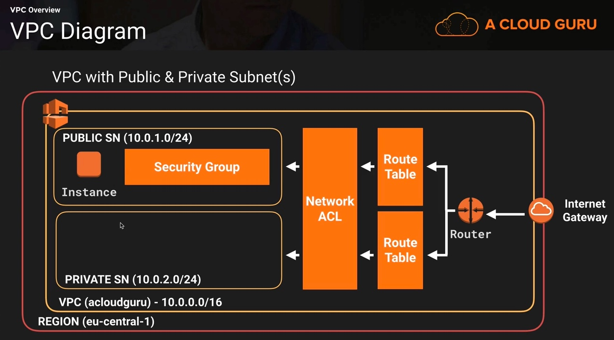
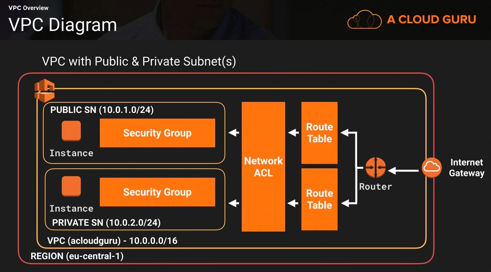
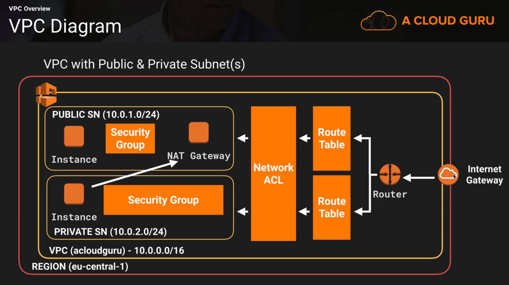

# Cisco cloud corner on AWS Network
Prerequisites:
- You must have a valid AWS account

This workshop has been inspired by the aCloudGuru course [Certified Solutions Architect - Associate 2017](https://acloud.guru/course/aws-certified-solutions-architect-associate/dashboard)

## Create a private network in the Cloud: Virtual Private Cloud (VPC)

### VPC - [AWS Definition](https://aws.amazon.com/vpc/):

Amazon Virtual Private Cloud (Amazon VPC) lets you provision a logically isolated section of the Amazon Web Services (AWS) cloud where you can launch AWS resources in a virtual network that you define. You have complete control over your virtual networking environment, including selection of your own IP address range, creation of subnets, and configuration of route tables and network gateways.  You can use both IPv4 and IPv6 in your VPC for secure and easy access to resources and applications.

1. First, we need to create a VPC
    1. From the AWS console, go to **Networking** -> **VPC**
    1. Got to **Your VPCs** and click **Create VPC**
    1. Enter
      - Name tag: **myCloudCornerVPC**
      - IPv4 CIDR block: **10.0.0.0/16**
      - Tenancy: **Default**
    1. Click **Yes, Create**
1. Then we need to create 2 subnets, 1 public and 1 private
    1. Got to **Subnets** and click **Create Subnet**
    1. Enter
      - Name tag: **10.0.1.0-eu-west-1a**
      - VPC: **myCloudCornerVPC**
      - Availability Zone: **eu-west-1a**
      - IPv4 CIDR Block: **10.0.1.0/24**
    1. Click **Yes, Create**
    1. Got to **Subnets** and click **Create Subnet**
    1. Enter
      - Name tag: **10.0.2.0-eu-west-1b**
      - VPC: **myCloudCornerVPC**
      - Availability Zone: **eu-west-1b**
      - IPv4 CIDR Block: **10.0.2.0/24**
    1. Click **Yes, Create**
1. Now we want to make public access to subnet **10.0.1.0-eu-west-1a**. For that, we need to create an Internet Gateway
    1. Go to **Internet Gateways** and click **Create Internet Gateway**
    1. Enter:
      - Name tag: **myCloudCornerIGW**
    1. Click **Yes, Create**
    1. Select **myCloudCornerIGW** in the list and click **Attach to VPC**
    1. Select **myCloudCornerVPC** in the list and click **Yes, Attach**
1. Now we need to create a route out to the internet
    1. Go to **Route Tables**. You can observe that a default Route Table has been created and is associated with VPC **myCloudCornerVPC**. The destination of this route is **10.0.0.0/16** allowing all subnets created inside this VPC to talk to each other. This is the main route table. It's best practice to let this route private
    1. Click **Create Route Table**
      1. Enter:
          - Name tag: **myPublicRoute**
          -  VPC: **myCloudCornerVPC**
      1. Click **Yes, Create**
      1. Select **myPublicRoute** in the list and go to folder **Routes**, then click **Edit**, then click **Add another route**
      1. Enter:
        - Destination: **0.0.0.0/0**
        - Target: **myCloudCornerIGW**
      1. Click **Save**
      1. Go to folder **Subnet Associations** and click **Edit**
      1. Select subnet **10.0.1.0-eu-west-1a**, then click **Save**
1. In order to auto assign Public IP addresses to the EC2 instances that will be deployed into the public subnet:
    1. Go to **Subnets**, select subnet **10.0.1.0-eu-west-1a** in the list and click **Subnet Actions -> Modify Auto-Assign Public IP**
    1. Select "Enable auto-assign Public IP" and click **Save**
1. Summary:
    1. We've created a custom VPC named **myCloudCornerVPC**
    1. We've created 2 subnets:
        - **10.0.1.0-eu-west-1a** with CIDR **10.0.1.0/24** and availability zone **eu-west-1a**
        - **10.0.1.0-eu-west-1b** with CIDR **10.0.2.0/24** and availability zone **eu-west-1b**
    1. We've created 2 route tables in that VPC:
        - The default route table that has no route out to the internet
        - The route **myPublicRoute** we've created has a route out to our internet gateway (IGW)
        - So any subnet associated to **myPublicRoute** route table will have internet access automatically
        - The subnet **10.0.1.0/24** is associated to this IGW and has internet access
        - The subnet **10.0.2.0/24** is associated to the default route table automatically. This default route table has no internet access. Anything deployed into this private subnet is not accessible by the internet and can not access the internet either

## Deploy EC2 instances in both public and private Subnets

1. First, we will deploy a EC2 instance in the public subnet
    1. From the AWS console, go to **Compute** -> **EC2**
    1. Select **Launch instance**, choose the first AMI in the list (Amazon Linux AMI) and click **Select**
    1. Keep the default Instance type (Free tier eligible) and click **Next:Configure Instance Details**
    1. Select:
      - Network: **myCloudCornerVPC**
      - Subnet: **10.0.1.0-eu-west-1a**
    1. Open the **Advanced Details** section and copy paste

    #!/bin/bash
    yum update -y
    yum install httpd -y
    service httpd start
    chkconfig httpd on
    echo "Hello Cloud Talkers. My Web Server address is: " > /var/www/html/index.html
    curl http://169.254.169.254/latest/meta-data/local-ipv4 >>  /var/www/html/index.html

    1. Click **Next:Add Storage**
    1. Click **Next:Tag Instance** and Enter:
      - Value tag: **myWebServer**
    1. Click **Next:Configure Security Group**
    1. Create a new Security Group and Enter:
      - Security Group Name: **WebDMZ**
      - Description: **WebDMZ**
    1. Click **Add Rule** and Enter:
      - Type: HTTP
      - Source: Anywhere (0.0.0.0/0)
    1. Click **Review and Launch**
    1. Click **Launch**
    1. In the "Select an existing key pair or create a new key pair window"
      - Select an existing key pair or create a new one
      - Acknowledge and click **Launch Instance**
    1. Click **View instances**. The first EC2 instance is now under creation. When it will be ready, it will have a Public IP assigned
    1. Copy/Paste the public IP Address in your browser. You should see the message **"Hello Cloud Talkers. My Web Server address is: 10.0.1.xx"**
    1. Summary:
    
      1. We've created one EC2 instance **myWebServer** into the VPC **myCloudCornerVPC** and the subnet **10.0.1.0-eu-west-1a**
      1. We've created a launch script that applies security patches, installs httpd server and displays the private IP address of the EC2 instance
      1. We've created a security group **WebDMZ** used by the EC2 instance in the public subnet that's allowing HTTP (port 80) and SSH (port 22) traffics from the world.
1. Then, we will deploy a EC2 instance in the private subnet
    1. From the AWS console, go to **Compute** -> **EC2**
    1. Select **Launch instance**, choose the first AMI in the list (Amazon Linux AMI) and click **Select**
    1. Keep the default Instance type (Free tier eligible) and click **Next:Configure Instance Details**
    1. Select:
      - Network: **myCloudCornerVPC**
      - Subnet: **10.0.1.0-eu-west-1b**
    1. Click **Next:Add Storage**
    1. Click **Next:Add Tags**
    1. Enter:
      - Value tag: **mySQLServer**
    1. Click **Next:Configure Security Group**
    1. Create a new Security Group. Enter:
      - Security Group Name: **RDSSG**
      - Description: **RDSSG**
    1. Click **Add Rule** and Enter:
      - Type: MYSQL/Aurora
      - Port Range: 3306
      - Source: Custom (10.0.1.0/24)
    1. Click **Add Rule** and Enter:
      - Type: All ICMP Traffic
      - Port Range: 0 - 65535
      - Source: Custom (10.0.1.0/24)
    1. Click **Review and Launch**
    1. Click **Launch**
    1. In the "Select an existing key pair or create a new key pair window"
      - select an existing key pair or create a new one
      - acknowledge and click **Launch Instance**
    1. Click **View instances**. The second EC2 instance is now under creation. When it will be ready, it will NOT have a Public IP assigned
    1. Summary:

      1. We've created one EC2 instance **mySQLServer** into the VPC **myCloudCornerVPC** and the subnet **10.0.1.0-eu-west-1b**
      1. We've created 1 security group **RDSSG** in the private subnet that's allowing HTTP (port 80), SSH (port 22) and ICMP (ports 0 to 65535) traffics from the address range **1.0.1.0/24.1**
1. SSH private instance from the public subnet
    1. Open a terminal
    1. Make sure your SSH key is available and is protected against write (chmod 0600)
    1. Enter
```bash
    ssh ec2-user@<publicIP> -i <keyPair.pem>
```
```bash
    sudo su
    # ping privateIP of EC2 instance located in private subnet
    ping 10.0.2.x
    Ctrl C
```
    1. You should be able to ping the private instance
    1. From the AWS console, go to **Networking** -> **VPC**
    1. Got to **Security Groups**, select **RDSSG** security group, go to folder **Inbound Rules** and click **Edit**
    1. Delete **ALL ICMP - IPv4** rules and Click **Save**
    1. Go back to your terminal and try to ping again the private instance
    1. It doesn't work
    1. Restore ICMP rules: From the AWS console, go to **Networking** -> **VPC**
    1. Got to **Security Groups**, select **RDSSG** security group, go to folder **Inbound Rules** and click **Edit**
    1. Click **Add another rule** and Enter:
      - Type: All ICMP Traffic
      - Source: 10.0.1.0/24
    1. Click **Save**
    1. Go back to your terminal and try to ping again the private instance. It should work
1. Access the internet from the private subnet in a secure way
    1. Open a terminal
    1. Edit the key pair content and copy it in the clipboard
    1. Enter
```bash
    chmod 0600 keyPair.pem
    ssh ec2-user@<publicIP> -i <keyPair.pem>
```
    1. Create a file keyPair.pem and paste the key pair from the clipboard
    1. Enter
```bash
    # Replace x by the private IP address of the EC2 instance deployed in the private subnet
    ssh ec2-user@10.0.2.x -i <keyPair.pem>
```
```bash
    sudo su
    yum update -y
```
    1. The *yum update -y* command doesn't work. It's because the private subnet has no internet access
    1. There is 2 ways to allow internet access from the private subnet:
      1. Deploy a NAT instance (old fashion, not scalable)
      1. Deploy a NAT gateway (available since 2016, recommended in a production environment, scalable, managed by AWS)
    1. From the AWS console, go to **Networking** -> **VPC**
    1. Got to **NAT Gateways** and click **Create NAT Gateway**
    1. Enter
      - Subnet: **10.0.1.0-eu-west-1a** (it must be the public subnet)
      - Click **Create new EIP**
    1. Click **Create a NAT Gateway**
    1. Into the "Create a NAT Gateway" popup, click **Edit Route Tables**
    1. Select the default Main route table associated to VPC **myCloudCornerVPC** in the list and go to folder **Routes**, then click **Edit**, then click **Add another route**
    1. Enter:
      - Destination: **0.0.0.0/0**
      - Target: **nat-xxxxxxxxxxx**
    1. Click **Save**
    1. Go back to the terminal window already connected to EC2 instance in the private subnet
    1. Enter
```bash
    # Replace x by the private IP address of the EC2 instance deployed in the private subnet
    ssh ec2-user@10.0.2.x -i <keyPair.pem>
```
```bash
    sudo su
    yum update -y
```
   1. The *yum update -y* command is now working.
   1. Summary:
    
      1. We've created a NAT Gateway into the public subnet **10.0.1.0-eu-west-1a**
      1. We've added a route in the default route table to allow traffic out to the internet through the NAT Gateway
      1. The default route table is used by the private subnet. So all the EC2 instances created in that subnet can access the internet but are not  accessible externally
